# 📘 Guia de Configuració de LVM (Logical Volume Manager)  

## **1️⃣ Configuració inicial**  

Primer, es crea una màquina virtual amb **Zorin OS**.

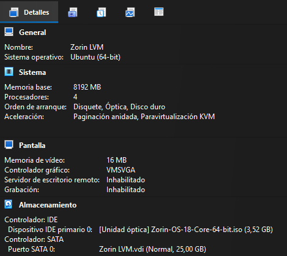

Amb la màquina apagada, afegim **dos discos de 10 GB** cadascun, que faran la funció d’unitats físiques addicionals del sistema.

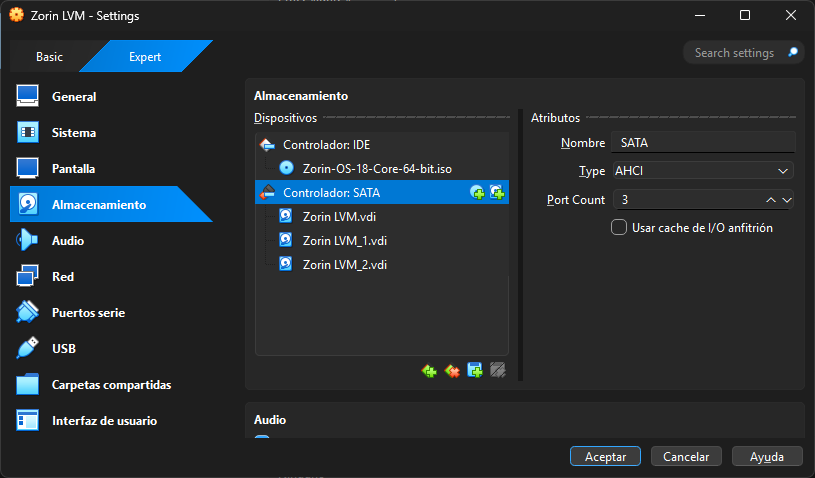

Un cop iniciada la màquina, instal·lem l’eina **fdisk** per comprovar que els discos s’han afegit correctament:

```bash
sudo apt install fdisk
```

Ara comprovem els discos disponibles:

```bash
sudo fdisk -l
```

Podem observar que, a més del disc principal (**sda**), apareixen els discos nous (**sdb** i **sdc**).

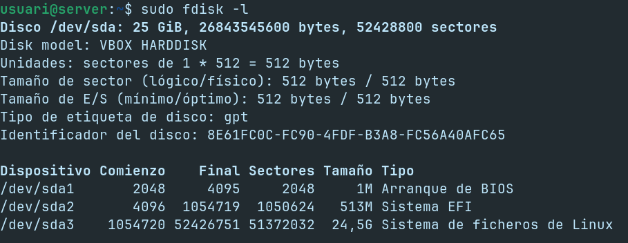

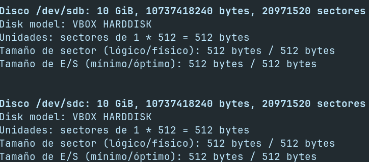

---

## **2️⃣ Creació dels volums físics (PV)**  

Ara haurem de crear els **volums físics** amb la comanda **pvcreate** (Physical Volume Create) i l’instal·larem amb la següent comanda:

```bash
sudo apt install lvm2
```

I executem les següents comandes per a crear-los:

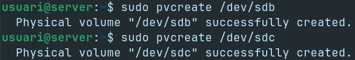

---

## **3️⃣ Creació del grup de volums (VG)**

Una vegada amb els **volums físics creats**, hem de **crear el grup de volums**, que és la capa on **s’unifiquen els diferents discos físics** per a tindre un **espai** on **després crear** els **volums lògics**.

Ho farem amb la següent comanda:

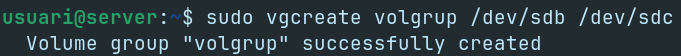

Podem verificar-lo amb:

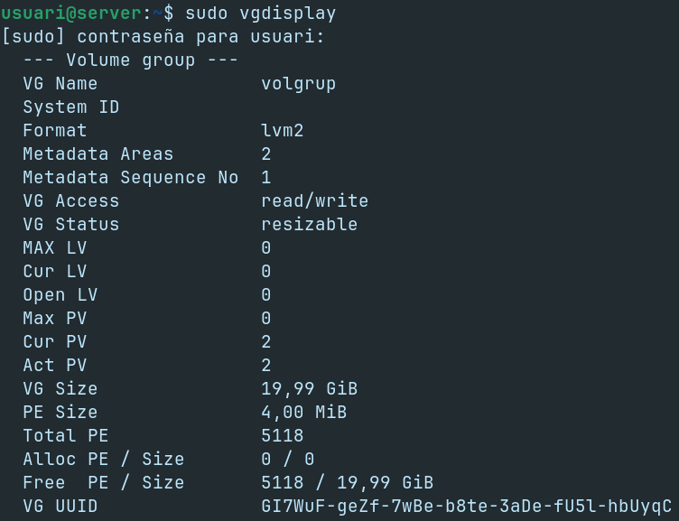

---

## **4️⃣ Creació del volum lògic (LV)**

Ara ja podem crear els **volums lògics**, ja que es creen a partir del **grup de volums**, indicant la mida, el nom i el **VG** que volem usar. 

En aquest cas crearem un **LV** amb **nom lv01** i **mida 200 MiB** i ho farem amb la següent comanda:

```bash
sudo lvcreate -L 200M -n lv01 volgrup
```

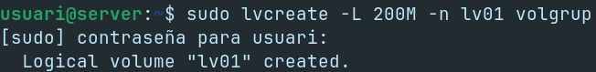

I si tornem a fer la comanda **vgdisplay**, podem veure que ja marca l’espai com a utilitzat:

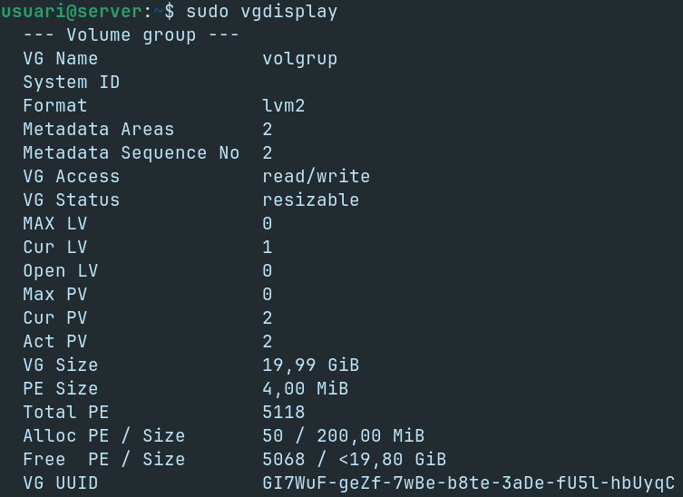

---

## **5️⃣ Formatació i muntatge del LV**

Hem creat el **LV**, però els **volums lògics** són com les **particions**, per tant, per utilitzar-se caldrà **formatar-los amb un sistema d’arxius**.

Primer **crearem la carpeta** per a poder **muntar el volum** dins del **sistema d’arxius**:

```bash
sudo mkdir /mnt/lv01
```

I després el **formatarem** utilitzant el **sistema d’arxius** **Ext4**:

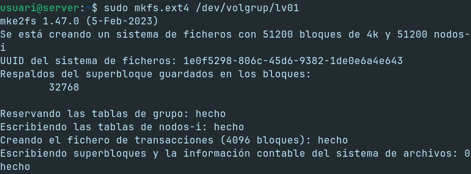

Per a poder utilitzar el **volum lògic**, cal utilitzar la comanda **mount** per a muntar el volum cap a la **carpeta creada** anteriorment amb la **següent comanda**:

```bash
sudo mount /dev/volgrup/lv01 /mnt/lv01
```

---

## **6️⃣ Muntatge persistent**

Encara que fer-ho d’aquesta manera és possible, **no és viable**, ja que caldria fer **aquesta acció cada vegada que s’inicia la màquina**.

Per això editarem l’arxiu **/etc/fstab** perquè el **volum lògic** quedi formatat i muntat de manera permanent.

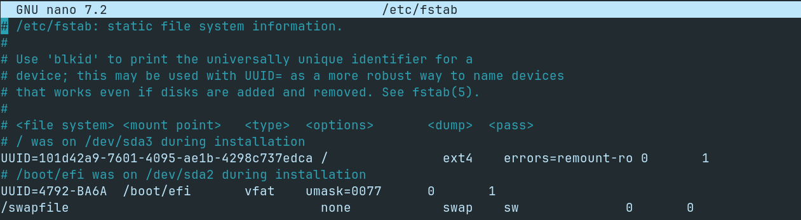

I afegirem la següent línia **/dev/volgrup/lv01 /mnt/lv01 ext4 defaults 0 0**, que té el següent significat:

- **/dev/volgrup/lv01**: unitat que es vol muntar.  
- **/mnt/lv01**: punt de muntatge.  
- **ext4**: per indicar el sistema de fitxers utilitzat.  
- **defaults**: les opcions de muntatge per defecte. Aquí es podria indicar si és només lectura, etc.  
- **dump**: 0 per indicar que el sistema de fitxers no s’hagi de bolcar. Avui dia és la configuració normal.  
- **pass**: 0 per indicar que no es faran comprovacions d’aquest volum en arrancar el sistema.

I apliquem els canvis:

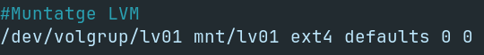

---

## **7️⃣ Alta disponibilitat (mirror)**

Per a tindre **redundància**, utilitzarem el **mirroring**, que és una **idea similar** al **RAID 1** però a nivell de **volums lògics**.

Per a poder fer-ho, primer haurem **d'esborrar** els **volums lògics** i el **grup de volums** creat prèviament.

Per a fer-ho seguirem els següents passos:

Primer **desmuntarem** el **volum lògic** amb la comanda **umount /mnt/lv01**, per a desmuntar el LV i **lvremove** per a eliminar-lo.


Ara **esborrarem la línia** que vam escriure a **/etc/fstab**, per a evitar que es **munti el volum automàticament**.

I per últim **eliminarem** el **VG** de **volgrup** amb la següent comanda:

```bash
sudo vgremove volgrup
```

I executem la comanda **pvs** per a veure que els volums estan lliures:

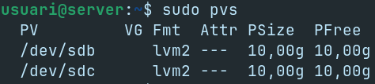

### **7.1. Creem el nou grup de volums per al mirror**

**Creem un grup de volums** amb els dos volums físics:

```bash
sudo vgcreate vg_mirror /dev/sdb /dev/sdc
```

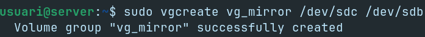

I ara **crearem** el sistema de **mirall (mirror) simple**:

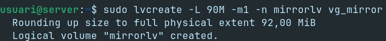

I podem **observar** com el **volum lògic** està format pels **miralls** i dels **logs** que serveixen per a **mantenir la sincronització**:

```bash
sudo lvs -a -o +devices | grep mirror
```

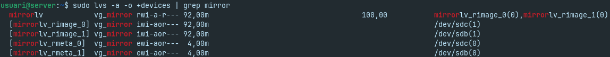

---

## **8️⃣ Instantànies (Snapshots)**

**Eliminarem el volum lògic anterior** i **ara en crearem un de nou** però de **100MiB de mida**:

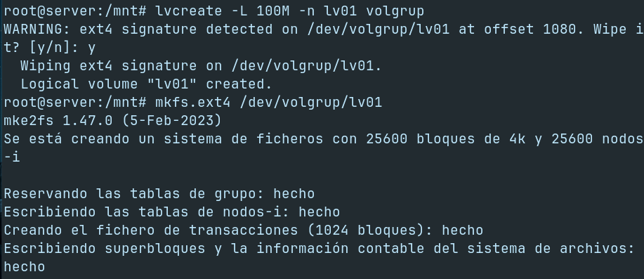

El formatem i **muntem a /mnt/lv01** amb la següent comanda:

```bash
sudo mount /dev/volgrup/lv01 /mnt/lv01
```

I **creem alguns arxius brossa** a dins amb la comada **fallocate**, que serveix per a **crear arxius d'una mida fixa de manera instantània**:

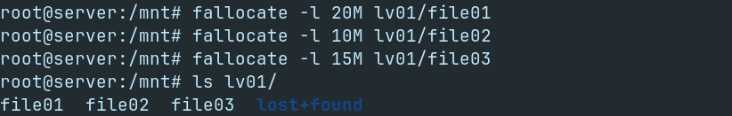

Ara **crearem la instantània (snapshot)** amb la següent comanda:

```bash
lvcreate -L 100M -s -n copia01 /dev/volgrup/lv01
```

**On té aquest significat:**

- **L 100M:** mida de la instantània.  
- **-s**: per indicar que és una snapshot.  
- **-n copialv01**: nom de la instantània.  
- **/dev/volgrup/lv01**: volum lògic del que es farà el snapshot.

###**8.1. Muntant la snapshot**

Després, **muntem la còpia** per veure el contingut amb les següents comandes:

Primer **creem la carpeta al directori /mnt**

```bash
sudo mkdir /mnt/snapshot
```

I després **muntem la còpia** per a veure el contingut i **podem veure que s’ha realitzat correctament**.

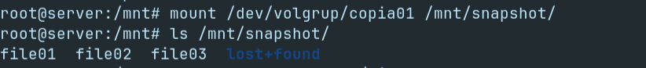

Per a veure la diferència real amb el **mirror**, **creem un arxiu a dins de lv01** per a veure que **a dins de la snapshot no apareix**.

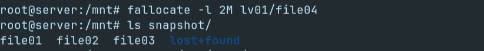

També, si **volem provar que la snapshot pot recuperar la informació de la lv01**, ho farem amb les següents comandes:

Primer **desmuntem les unitats**:

```bash
sudo umount /mnt/lv01
sudo umount /mnt/snapshot
```

I després ja podem **aplicar-la** i podem veure que **ha desaparegut el file04**, per tant, **s’ha restaurat la snapshot correctament**.  

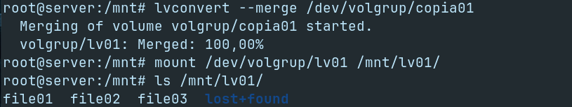

[Tornar a enunciat](README.md)
